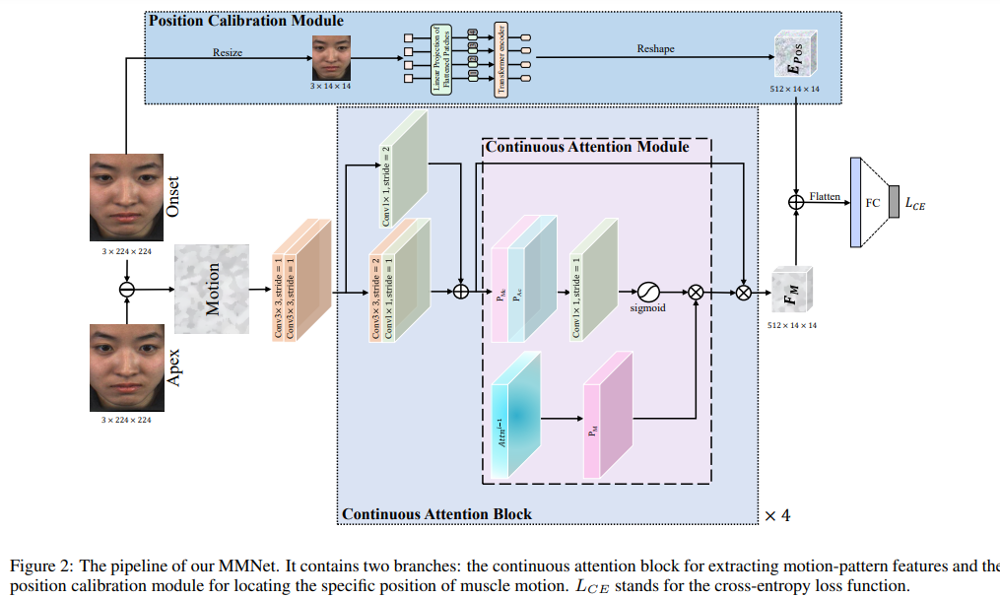

# MMNet
A novel two-branch （micro-expression recognition）MER paradigm

# Training on CASME II dataset
```bash
# 3-class MER
python CASME2_3.py
# 5-class MER
python CASME2_5.py
```
# Citation
If you find our work useful, please consider citing our paper:
```bash
@inproceedings{li2022mmnet,
  title={MMNet: Muscle motion-guided network for micro-expression recognition},
  author={Li, Hanting and Sui, Mingzhe and Zhu, Zhaoqing and Zhao, Feng},
  booktitle={Proceedings of the 31th International Joint Conference on Artificial Intelligence},
  year={2022}
}
```
